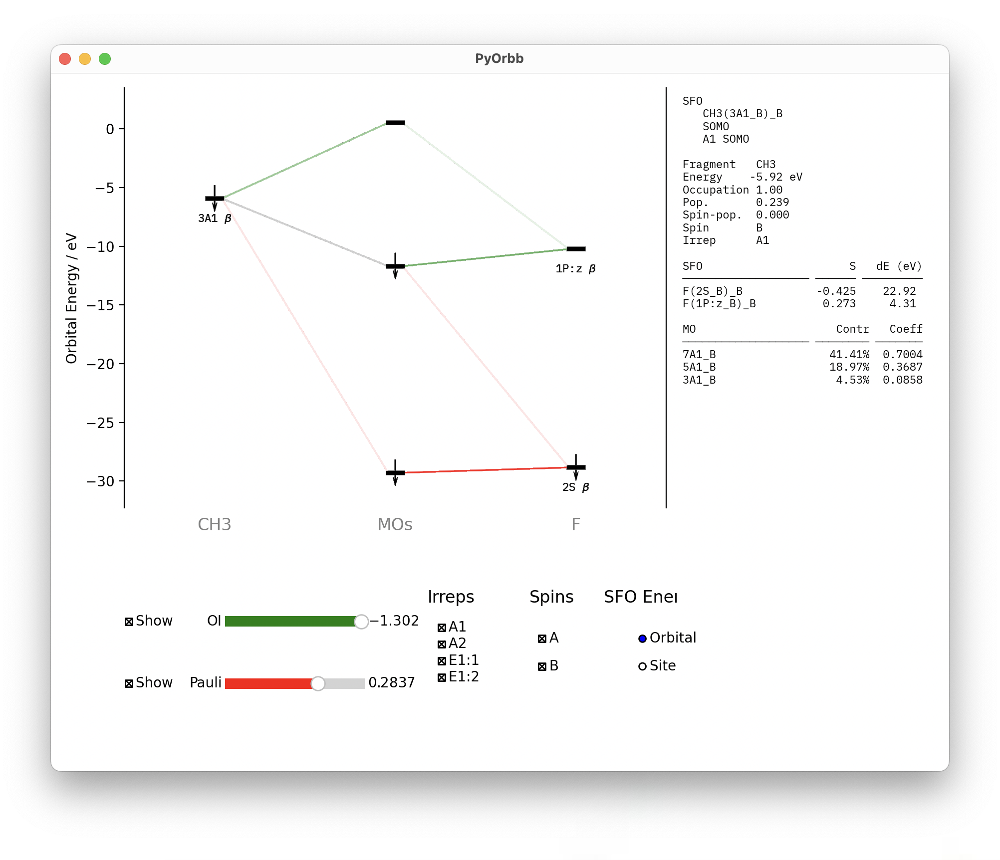
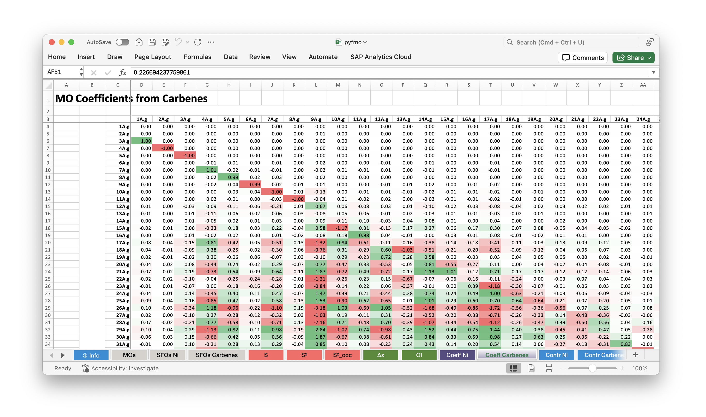

PyOrbb Command-Line Tools
=========================

PyOrbb offers two command-line interface programs that allow the user to quickly get started in their bonding analysis.
The first, :ref:`pyfmo-analyse`, starts the interactive user-interface that shows the most important orbital mixing situations found by PyOrbb. The second, :ref:`pyfmo-excel` writes orbital information to a usefull Excel spreadsheet that shows the complete information extracted by PyOrbb.

.. _pyfmo-analyse:

``pyfmo analyse``
-----------------

This program provides the user with an interactive orbital interaction diagram that shows the most important mixing situations for the given system.

**usage**: ``pyfmo analyse rkf``

positional arguments:
  ``rkf``:         The path to the ``adf.rkf`` file to generate the interaction diagram for.

.. _pyfmo-excel:

``pyfmo excel``
---------------

This program writes a comprehensive overview of all available information PyOrbb extracted from the ``adf.rkf`` file provided by the user.

**usage**: ``pyfmo excel [-o OUTPUT] rkf``

positional arguments:
  ``rkf``:                   The path to the ``adf.rkf`` file to summarize in an Excel file.

options:
  ``-o OUTPUT``, ``--output OUTPUT``
                        Set the path to which to write the Excel file.