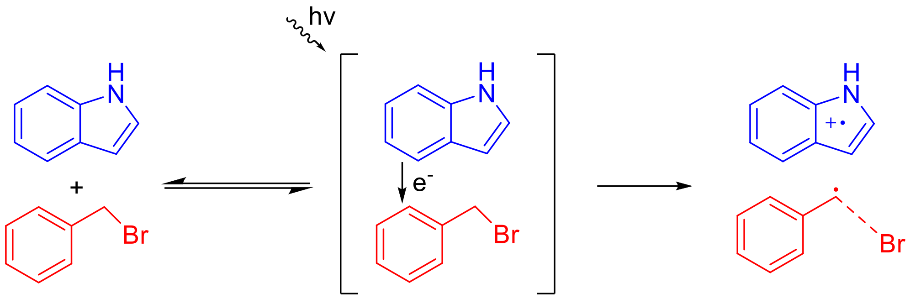

Analysis of Electronic Excitations
==================================

Electron donor-acceptor (EDA) complexes are photoactive complexes that have UV/VIS absorption bands that are not present in the donor and acceptor molecules separately. This indicates an excitation that corresponds to the transfer of an electron from the electron donor to the acceptor. EDA complexes can be used, among other things, to photogenerate radicals without the use of toxic metals. The electron transfer band is often red-shifted, so the use of low energy UV or even visible light is often possible.

 Generation of two free radicals by the photon-mediated electron transfer in the indole-benzylbromide electron donor complex.

While the AMSSpectra program provides a nice graphical user interface to view electronic excitations calculated using ADF, there is sometimes a need to programmatically access the data from these calculations. In this example we will load and analyse excitations from an ADF calculation on the indole-benzylbromide complex using the TCutility package. We will also implement some tunable thresholds to filter the excitations the program reads.
r

**Download** :download:`excitations.adf.rkf <../../examples/excitations/excitations.adf.rkf>`

**Download** :download:`exc_analysis.py <../../examples/excitations/exc_analysis.py>`

.. tabs:: 

	.. tab:: ``exc_analysis.py`` 

		.. literalinclude:: ../../examples/excitations/exc_analysis.py
			:language: python

	.. tab:: Output

		The expected output is as follows

		.. code-block::

			Excitation[A, SS, 2]:
			  λ   = 384.9 nm
			  f12 = 0.0006 a.u.
			  Transitions:
			    73A_B (99.2% Donor) -> 74A_B (99.2% Acceptor)
			    73A_A (99.2% Donor) -> 74A_A (99.2% Acceptor)

			Excitation[A, SS, 5]:
			  λ   = 340.1 nm
			  f12 = 0.0172 a.u.
			  Transitions:
			    72A_B (93.5% Donor) -> 74A_B (99.2% Acceptor)
			    72A_A (93.5% Donor) -> 74A_A (99.2% Acceptor)

			Excitation[A, SS, 9]:
			  λ   = 308.2 nm
			  f12 = 0.0003 a.u.
			  Transitions:
			    73A_A (99.2% Donor) -> 76A_A (98.7% Acceptor)
			    73A_B (99.2% Donor) -> 76A_B (98.7% Acceptor)

