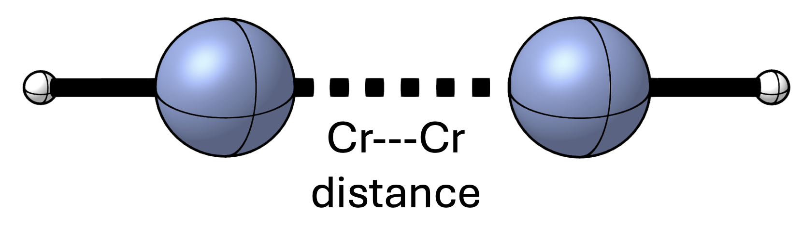
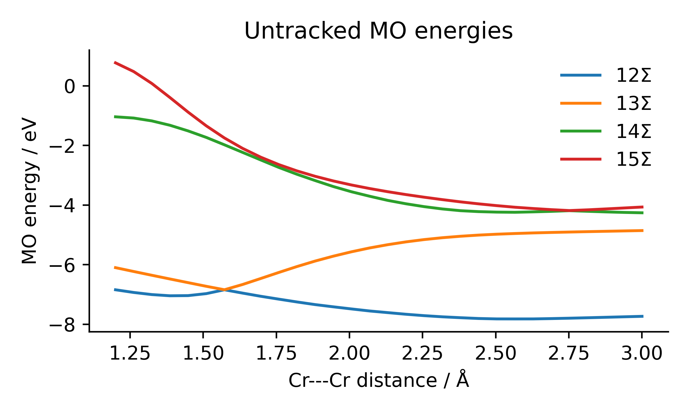
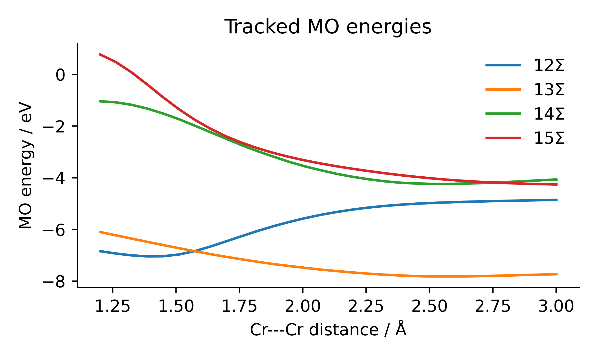

Tracking Molecular Orbitals Along a Reaction Pathway
====================================================

It can often be insightful to investigate the evolution of orbitals along the potential energy surface of a chemical system. However, when investigating systems with large geometric deformations, there may be cases where the ordering of the molecular orbitals changes from one step to the next. In this example we investigate the MO energies along the stretching of the Cr-Cr bond of the chromium(I) hydride dimer.

 
 The chromium(I) hydride dimer we investigate in this example. The Cr–Cr bond distance is varied between 1.2 and 3.0 angstrom over 30 steps.

Without tracking
----------------

To illustrate the problem we will obtain the MO energies of the 12Σ, 13Σ, 14Σ, and 15Σ MOs along the stretching coordinate. Selecting means that we simply take the energies of the MOs named "12Σ", "13Σ", "14Σ", and "15Σ" from the adf.rkf files. In the figure below we see that the MOs 12Σ (blue line) and 13Σ (orange line) switch ordering around 1.6 Å when the energy of 13Σ dips below that of 12Σ. Similarly, around 2.8 Å we see that 15Σ should become more stable than 14Σ.

 
 Energies of the 12Σ, 13Σ, 14Σ, and 15Σ orbitals along the bond stretching coordinate of the chromium(I) hydride dimer (HCr–CrH).

Orbital tracking
----------------

To obtain the correct energies of the MOs in question we rely on calculating and comparing the overlap populations of the MOs and FMOs between each step. We compute for each step (:math:`T`) an order-3 tensor containing the overlap population of each MO :math:`\Psi_i^T` and to each pair of FMOs :math:`\psi_j^T` and :math:`\psi_k^T` of step :math:`T`:

.. math::

   P_{ijk}^T = \langle \psi_j^T | \Psi_i^T \rangle \langle \psi_k^T | \Psi_i^T \rangle \langle \psi_j^T | \psi_k^T \rangle,

where :math:`\langle \psi_j^T | \Psi_i^T \rangle` is the mixing coefficient of :math:`\psi_j^T` into :math:`\Psi_i^T`, and :math:`\langle \psi_j^T | \psi_k^T \rangle` is the overlap integral between :math:`\psi_j^T` and :math:`\psi_k^T`. Starting from the matrix slice corresponding to the inital MO (*e.g.*, :math:`P_{12Σ,jk}^1` for MO 12Σ of the first step) we calculate the difference between the initial slice with all slices in the order-3 tensor of the next step. The MO corresponding to the slice with the smallest difference should be the most similar MO. We then continue this process for all given steps to "track" the MOs along the bond stretching coordinate.

.. math::

  \mathrm{argmin}_i \sum_j\sum_k |P_{\mathrm{initial}, jk}^T - P_{ijk}^{T+1}|,

where :math:`P_{\mathrm{initial}, jk}^T` is the overlap population matrix for the initial MO at step :math:`T`.

PyOrbb includes an easy-to-use implementation for this algorithm (:py:class:`pyorbb.analysis.sequential.MOTracker`). Using this implementation we obtain the correctly tracked MOs for our systems (see Figure below).

 
 Energies of the 12Σ, 13Σ, 14Σ, and 15Σ orbitals tracked along the bond stretching coordinate of the chromium(I) hydride dimer (HCr–CrH).

After tracking the MOs correctly we see that the MOs that previously switched order now cross each other. *E.g.*, 12Σ now correctly keeps increasing in energy and becomes higher in energy than 13Σ around 1.6 Å. The same happens for 14Σ and 15Σ around 2.8 Å. We can also generate movies of the evolution of the orbitals along the bond stretching. We see that the MOs stay consistent along the complete coordinate. Conversely, the movies showing the untracked orbitals show clearly that the orbitals are not consistent across the whole coordinate, with large changes in their shapes.

Visualization
-------------

.. tabs::

  .. tab:: Tracked

    .. list-table::
      :class: borderless

      * - .. video:: tracked_12SIGMA.mp4
            :autoplay:
            :align: center
            :width: 100%
            :loop:
            :caption: 12Σ
        - .. video:: tracked_13SIGMA.mp4
            :autoplay:
            :align: center
            :width: 100%
            :loop:
            :caption: 13Σ
      * - .. video:: tracked_14SIGMA.mp4
            :autoplay:
            :align: center
            :width: 100%
            :loop:
            :caption: 14Σ
        - .. video:: tracked_15SIGMA.mp4
            :autoplay:
            :align: center
            :width: 100%
            :loop:
            :caption: 15Σ

  .. tab:: Untracked

    .. list-table::
      :class: borderless

      * - .. video:: untracked_12SIGMA.mp4
            :autoplay:
            :align: center
            :width: 100%
            :loop:
            :caption: 12Σ
        - .. video:: untracked_13SIGMA.mp4
            :autoplay:
            :align: center
            :width: 100%
            :loop:
            :caption: 13Σ
      * - .. video:: untracked_14SIGMA.mp4
            :autoplay:
            :align: center
            :width: 100%
            :loop:
            :caption: 14Σ
        - .. video:: untracked_15SIGMA.mp4
            :autoplay:
            :align: center
            :width: 100%
            :loop:
            :caption: 15Σ

Script and Resources
---------------------

The rkf files have been split into two separate zip files. Make sure to extract them into the same folder.

**Download** :download:`rkfs.1.zip <../../examples/mo_tracking/rkfs.1.zip>`

**Download** :download:`rkfs.2.zip <../../examples/mo_tracking/rkfs.2.zip>`

**Download** :download:`sequential_example.py <../../examples/mo_tracking/sequential_example.py>`

.. literalinclude:: ../../examples/mo_tracking/sequential_example.py
  :language: python

