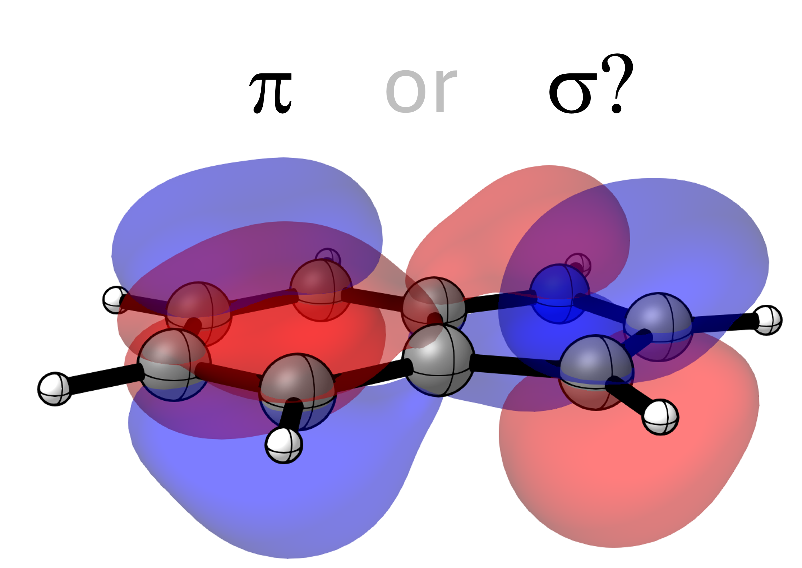

Detection of π-Orbitals
=======================

It can often be important to differentiate between the symmetries of orbitals. Especially in the case of planar aromatic molecules it can be crucial to know which orbitals are π-symmetric and which ones are σ-symmetric.

Differentiation of π- and σ-orbitals can be performed easily using the PyOrbb Python API.
In this tutorial we consider the molecular orbitals of the indole molecule calculated at the OLYP/TZ2P level of theory using ADF2025. The input molecule was randomly oriented so we must first obtain the normal vector of the plane. We then calculate the alignment of the carbon and nitrogen 2p-orbitals with this normal vector to obtain an alignment score that should indicate either π- or σ-character.

Download :download:`indole.adf.rkf <../../examples/pi_orbitals/indole.adf.rkf>`

Download :download:`pi_orbitals.py <../../examples/pi_orbitals/pi_orbitals.py>`

.. tabs:: 

	.. tab:: ``pi_orbitals.py`` 

		.. literalinclude:: ../../examples/pi_orbitals/pi_orbitals.py
			:language: python

	.. tab:: Output

		The expected output is as follows

		.. code-block::

			π-MOs:
			 14A	 20A	 21A	 22A	 23A	 35A	 47A	 56A	 62A	 68A	 73A	 78A	 86A	 
			 97A	 99A	107A	109A	132A	137A	180A	205A	242A	248A	249A	250A	259A

			σ-MOs:
			  1A	  2A	  3A	  4A	  5A	  6A	  7A	  8A	  9A	 10A	 11A	 12A	 13A	 
			  15A	 16A	 17A	 18A	 19A	 24A	 25A	 26A	 27A	 28A	 29A	 30A	 31A	 
			  32A	 33A	 34A	 36A	 37A	 38A	 39A	 40A	 41A	 42A	 43A	 44A	 45A	 
			  46A	 48A	 49A	 50A	 51A	 52A	 53A	 54A	 55A	 57A	 58A	 59A	 60A	 
			  61A	 63A	 64A	 65A	 66A	 67A	 69A	 70A	 71A	 72A	 74A	 75A	 76A	 
			  77A	 79A	 80A	 81A	 82A	 83A	 84A	 85A	 87A	 88A	 89A	 90A	 91A	 
			  92A	 93A	 94A	 95A	 96A	 98A	100A	101A	102A	103A	104A	105A	106A	
			  108A	110A	111A	112A	113A	114A	115A	116A	117A	118A	119A	120A	121A	
			  122A	123A	124A	125A	126A	127A	128A	129A	130A	131A	133A	134A	135A	
			  136A	138A	139A	140A	141A	142A	143A	144A	145A	146A	147A	148A	149A	
			  150A	151A	152A	153A	154A	155A	156A	157A	158A	159A	160A	161A	162A	
			  163A	164A	165A	166A	167A	168A	169A	170A	171A	172A	173A	174A	175A	
			  176A	177A	178A	179A	181A	182A	183A	184A	185A	186A	187A	188A	189A	
			  190A	191A	192A	193A	194A	195A	196A	197A	198A	199A	200A	201A	202A	
			  203A	204A	206A	207A	208A	209A	210A	211A	212A	213A	214A	215A	216A	
			  217A	218A	219A	220A	221A	222A	223A	224A	225A	226A	227A	228A	229A	
			  230A	231A	232A	233A	234A	235A	236A	237A	238A	239A	240A	241A	243A	
			  244A	245A	246A	247A	251A	252A	253A	254A	255A	256A	257A	258A	260A	
			  261A	262A	263A	264A	265A	266A	267A	268A	269A	270A	271A	272A	273A	
			  274A	275A	276A	277A	278A	279A	280A	281A	282A	283A	284A	285A	286A	
			  287A	288A	289A	290A	291A	292A	293A
