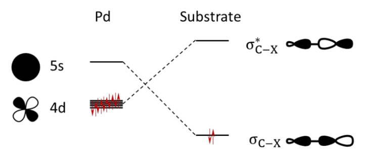

Orbital Interaction Mechanism Along a Reaction Pathway
======================================================

.. video:: orbint.mp4
  :autoplay:
  :align: center
  :width: 100%
  :loop:
  :caption: Output video showing the orbital mechanism, overlap, and orbital energy gaps for the oxidative addition reaction of palladium into the C-H bond of methane. The dashed verticle line shows the C-H distance of the transition state.

A popular analysis method in quantum chemical modelling involves performing fragment analyses along a reaction coordinate to track how certain properties change during a reaction. This often involves some kind of partitioning of the total electronic energy, such as the activation strain model (ASM) and/or the energy decomposition analysis (EDA). For a comprehensive guide, see `Vermeeren, P., et al. Nature Protoc. 2020 <https://www.nature.com/articles/s41596-019-0265-0>`_.

 
 The oxidative addition reaction of palladium into the methane C-H bond.

ASM/EDA has been successfully applied to many different chemical systems. Subsequent KS-MO analysis has also been successfully performed, however, this is usually done at a single consistent geometry. With PyOrbb we can now perform KS-MO analysis along the full reaction coordinate. This example shows how this could be a usefull tool to aid the understanding of chemical reactions at the orbital interaction scale.

We will apply this idea to the oxidative addition of a palladium atom into the methane C-H bond. Palladium catalysts are often used in cross-coupling reactions and the oxidative addition is usually the rate-determining step as it involves breaking a relatively strong bond (C-H in this case). Because it is the rate-determining step this reaction is the target of numerous computational and experimental studies.

We have calculated the intrinsic reaction coordinate path (IRC) from the transition state (TS) of the oxidative addition reaction. We then used PyFrag to easily perform fragment analyses at each converged structure along the IRC path. We split the molecular system into the CH\ :sub:`4` and Pd fragments.

 
 The dominant orbital interaction pattern for the oxidative addition reaction.

We know from past research (`Diefenbach, A., et al. J. Phys. Chem. A 2004 <https://pubs.acs.org/doi/10.1021/jp047986%2B>`_, `Diefenbach, A., et al. J. Chem. Theory and Comp. 2005 <https://pubs.acs.org/doi/10.1021/ct0499478>`_) that at the start of the oxidative addition reaction the stabilizing interaction between the empty Pd(5S) orbital and the filled CH\ :sub:`4`\ (𝜎\ :sub:`C-H`\ ) dominates. As the reaction progresses towards the TS the orbital interaction between the filled Pd(4d\ :sub:`x2-y2`\ ) orbital and the empty (𝜎\ :sup:`*`:sub:`C-H`\ ) orbital becomes more important. The video generated by the script shows the evolution of the orbital interaction mechanism of the oxidative addition reaction of Pd into CH\ :sub:`4`, as well as the overlaps and orbital energy gaps of the Pd(5s)/CH\ :sub:`4`\ (𝜎\ :sub:`C-H`\ ) and Pd(4d\ :sub:`x2-y2`\ )/CH\ :sub:`4`\ (𝜎\ :sup:`*`\ :sub:`C-H`\ ) interactions. It shows that as the reaction proceeds the overlaps for both interactions increase significantly, with the interaction between Pd(5s)/CH\ :sub:`4`\ (𝜎\ :sub:`C-H`\ ) having the highest overlap across all C-H bond distances, making it the dominant interaction at the start of the reaction. Note however, that the energy gap of the Pd(4d\ :sub:`x2-y2`\ )/CH\ :sub:`4`\ (𝜎\ :sup:`*`\ :sub:`C-H`\ ) interaction quickly decreases as the reaction proceeds and approaches and crosses 0 eV. This means that the stabilizing orbital interaction for this interaction becomes more and more important as the reaction progresses. The generated video confirms the findings from the literature and is a quick and easy way to understand the orbital interactions given any Pyfrag analysis.

**Download** :download:`OxAdd_rkfs.zip <../../examples/tracking/OxAdd_rkfs.zip>`

**Download** :download:`tracking.py <../../examples/tracking/tracking.py>`

.. literalinclude:: ../../examples/tracking/tracking.py
	:language: python

