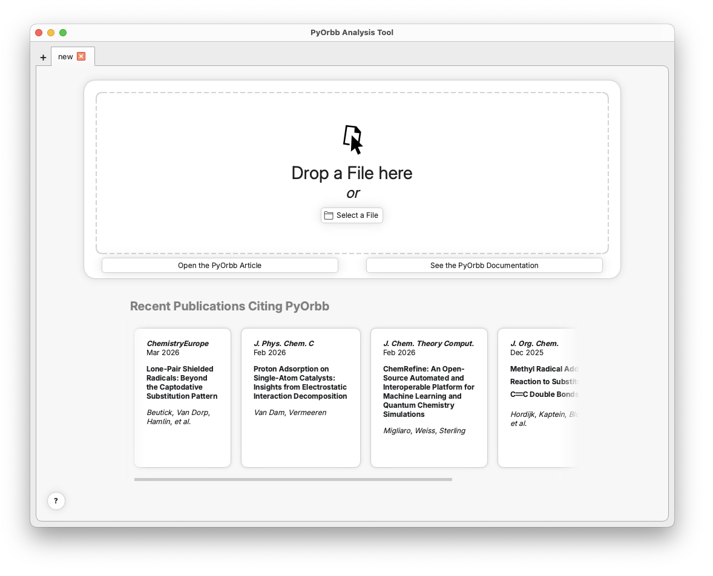

Getting Started
###############

PyOrbb is a tool designed to help you perform orbital interaction analyses. It provides you with an intuitive user-interface capable of producing intuitive orbital interaction diagrams. In this tutorial we will walk through the process of performing a basic PyOrbb analysis using the Graphical User Interace (GUI) of PyOrbb. Throughout this tutorial we will be using the results of a calculation containing the H\ :sub:`3`\ N→BH\ :sub:`3` Lewis acid-base pair, which you can download here: :download:`NH3_BH3.rkf <NH3_BH3.rkf>`.

.. seealso::
	`Click here <https://www.scm.com/doc/Tutorials/Analysis/FragmentAnalysis.html>`_ for a tutorial on the AMS website on how to perform fragment calculations yourself.

.. note::
   Some functionality of PyOrbb requires a valid installation of the AMS program.

Starting PyOrbb
===============

When you open PyOrbb you will be greeted by the welcome screen. Here you can find a link to the PyOrbb article and the documentation page. You can also see articles that have been recently published that cite PyOrbb.

Loading Calculation Results
===========================

.. admonition:: **Step 1**: Load the calculation results
	:class: important

	Drag the ``NH3_BH3.rkf`` file into the PyOrbb window. Alternatively, click the "Select a File" button and navigate to the file's location.

When a valid ``NH3_BH3.rkf`` file is provided, PyOrbb will automatically analyse the contents of the file and present you with a new screen showing the results of the analysis. The screen shows you the main orbital interaction mechanism as predicted by PyOrbb.

.. raw:: html

   

   

     
     
     <!-- position each overlay div with top/left/width/height as % of image -->

     

     

     

     

     
   

.. tab-set::
   :class: gui-tabs

   .. tab-item:: Diagram

   	  **Main orbital interaction diagram generated by PyOrbb**

   	  This part of the diagram shows you the orbital interactions identified by PyOrbb.

   	  The small black horizontal lines are the energy-levels of the orbitals and are arranged by the molecular species they belong to. In this case the left and right columns are for the fragment orbitals (FMOs) and the middle column is for the molecular orbitals (MOs). The levels can be populated by 0, 1, or 2 electrons, indicated by the arrows, and the directions of the arrows indicate the spin they posses: pointing up corresponds to alpha-spin and down to beta-spin. 

   	  The lines between the FMOs and MOs indicate whether there is a contribution from the FMO to the MO. The brightness is determined by the Mulliken contribution between the orbitals, and the color of it indicates what kind of interaction it is. Red indicates a Pauli-repulsive interaction, green indicates an orbital interaction, grey indicates a connection participating in both Pauli-repulsive and orbital interactions, and purple indicates connections added during the santization step of the algorithm.

	  .. admonition:: Interactive elements
		 :class: seealso

		 **Several elements are clickable in the diagram:**

		 1. The names of the columns are double-clickable and renamble. You can also drag and drop them to reorder the columns however you like.
		 2. The y-axis can be double-clicked to manually set the axis limits.
		 3. The orbital levels and connections are clickable and will show information about them and their interaction in the Information Tab. You can hold shift to select multiple levels or connections at once.
		 4. If there are notices (warnings or errors) related to the orbitals they will have a small warning sign next to them. Clicking these will open the corresponding notice on the right side for you.

   .. tab-item:: Information Tabs

      **Main information sections**

      The information tabs show you information related to orbitals, molecules, the overall system, and any errors or warnings that were detected during loading of the calculation results. The information is organized in 3 tabs. The information can be viewed by clicking the headers inside the tabs.

      **Orbitals**

      When clicking an orbital or a connection in the main diagram, PyOrbb will display relevant information in this tab. This includes basic information such as orbital energies, overlaps, coefficients and Mulliken contributions and populations. If two interaction orbitals are selected (by using shift + click to select multiple objects at once), the details of the orbital interaction analysis are shown, including each term that went into calculating the orbital interaction or Pauli repulsive interaction ranking numbers.

      **System**

      PyOrbb provides information about the general system, the complex molecule and each of the fragments.

      **Notices**

      PyOrbb will give notice of any warnings or errors that it detected during the loading of the ``NH3_BH3.rkf`` file. These will show up here. Clicking on any exclamation marks in the diagram will also highlight the error/warning message associated with it.

      .. seealso::
		   For an overview of all warnings and errors that PyOrbb detects, please see `this page <notices.html>`_.

   .. tab-item:: Sliders

      **Setting orbital interaction ranking thresholds**

      The sliders are used to adjust the thresholds that PyOrbb uses to determine which interactions to include. The lower the threshold value is the more interactions are included in the main diagram.

      .. seealso::
         See Section 3.2 in the `main article <notices.html>`_ for more information about the orbital interaction ranking algorithm.

   .. tab-item:: Filters & Options

      PyOrbb gives a multitude of options to tune, filter, or visualize the orbital interactions shown.

      **Draw Orbitals**

      When orbitals or connections are selected in the main diagram the Draw Orbitals button is activated. Clicking it will then show you a dropdown menu with several options for drawing the orbitals involved.

      .. note::
         To draw orbitals, PyOrbb needs access to the ``densf`` program provided by AMS. Set the path to your AMS installation using Preferences → Open Settings → Densf → AMS Application

      **Filter**

      When one or more orbitals have been selected the Filter button is activated. If clicked, PyOrbb will ensure that all interactions drawn in the diagram involve the selected orbitals. Clicking the Filter button again deactivates the filter.

      **Energy Type**

      PyOrbb will attempt to gather various FMO energy types when loading the results of a calculation. By default the regular energies are used (*i.e.* the FMO energies in density of the complex), but other options are also available if they are present in the provided file. PyOrbb will also always provide the option to use approximate effective energies.

      .. seealso::
         See Section S1 in the `supporting information <notices.html>`_ for more information about the FMO energy types and their uses.

      **Orbitals**

      One can also manually include or exclude specific orbitals from the interaction. This also includes the option to remove orbitals of specific spin-types or irreducible representations.

   .. tab-item:: Save Buttons

      **Producing the main output of PyOrbb**

      When you are happy with the diagram shown you can export the main orbital interaction diagram using the Save Figure button. PyOrbb also provides the option to generate a spreadsheet containing an overview of information about the calculation, mostly usefull for manual inspection of the data.

Orbital Interaction Mechanisms
==============================

After loading the 
